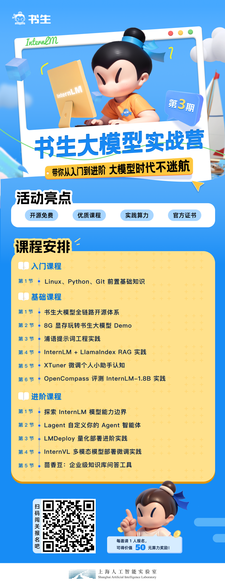

# 书生大模型实战营-蟹老板

## ⭐官方出品，必属精品：

- 闯关手册：https://aicarrier.feishu.cn/wiki/KFBSwxJ3Riu3uWkIN1jcyBoWnyf
- internStudio：https://studio.intern-ai.org.cn/console/dashboard
- InternLMgithub：https://github.com/InternLM/
- 实战营github：https://github.com/InternLM/Tutorial/tree/camp3

## 🦀蟹老板独家通关秘籍

- 🚪入门岛：

| 序号  | 名称         | 笔记链接                                                                                          |
|-----|------------|-----------------------------------------------------------------------------------------------|
| 第1关 | Linux基础知识  | [点我](https://blog.csdn.net/weixin_59605625/article/details/141059328)                         |
| 第2关 | Python基础知识 | [点我](https://blog.csdn.net/weixin_59605625/article/details/141060034)                         |
| 第3关 | Git基础知识 | [点我](https://blog.csdn.net/weixin_59605625/article/details/141060904?spm=1001.2014.3001.5501) |

- 🔧基础岛：

| 序号  | 名称         | 笔记链接                          |
|-----|------------|-------------------------------|
| 第1关 | 书生大模型全链路开源体系  | [点我](笔记/L1/L1-01-HelloIntern.md) |
| 第2关 | 8G显存玩转书生大模型Demo  | [点我](笔记/L1/L1-02-demo.md)        |
| 第3关 | 浦语提示词工程实践  | [点我](笔记/L1/L1-03-Prompt.md)      |
| 第4关 | InternLM+LlamaIndex RAG实践 | [点我](笔记/L1/L1-04-LlamaIndex.md)  |
| 第5关 | XTuner微调个人小助手认知  | [点我](笔记/L1/L1-05-XTuner.md)      |
| 第6关 | OpenCompass评测InternLM-1.8B实践  | [点我](笔记/L1/L1-06-OpenCompass.md)              |

- 🔨进阶岛：

| 序号  | 名称         | 笔记链接                              |
|-----|------------|-----------------------------------|
| 第1关 | 探索InternLM 模型能力边界  | [点我](笔记/L2/L2-01-CompassArena.md) |
| 第2关 | Lagent 自定义你的 Agent 智能体  | [点我](笔记/L2/L2-02-Lagent.md)       |
| 第3关 |LMDeploy 量化部署进阶实践| [点我](笔记/L2/L2-03-LMDeploy.md)     |
| 第4关 |InternVL 多模态模型部署微调实践| [点我](笔记/L2/L2-04-InternVL.md)                |
| 第5关 |茴香豆：企业级知识库问答工具|                                   |

- 🌈彩蛋岛：

| 序号  | 名称         | 笔记链接                         |
|-----|------------|------------------------------|
| 第1关 | MindSearch快速部署  | [点我](笔记/L3/L3-01-MindSearch.md) |
| 第2关 | 销冠大模型案例  |                              |
| 第3关 | InternLM 1.8B 模型 Android 端侧部署实践 |                              |
| 第4关 | AI 顶会盘点 LLM 工作流  |                              |

## 🎇恭喜，闯关通过

- 结业证书：
  

## 🛠欢迎加入一起入坑大模型

扫我扫我快扫我！
