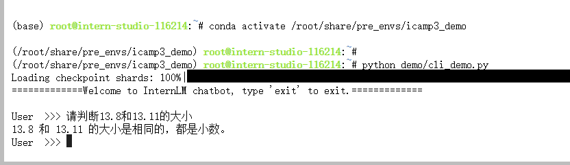
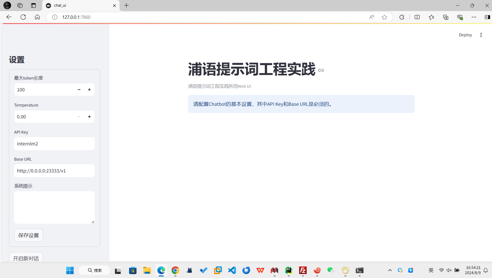
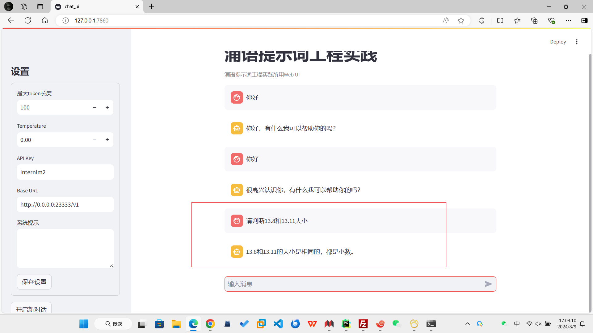
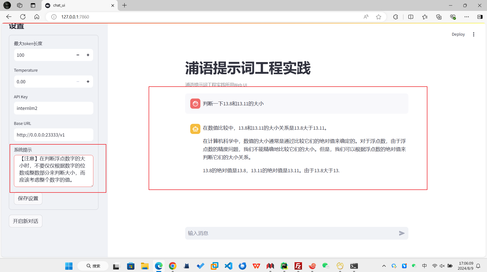

# 基础岛-第3关-浦语提示词工程实践

## 0、背景
试了一下，确实会出现错误。


## 1、环境准备
虚拟环境配置：
```yaml
# 新建虚拟环境
conda create -n langgpt python=3.10 -y
```

```yaml
# 激活环境
conda activate langgpt
```

```yaml
# 安装一些必要的库
conda install pytorch==2.1.2 torchvision==0.16.2 torchaudio==2.1.2 pytorch-cuda=12.1 -c pytorch -c nvidia -y

# 安装其他依赖
pip install transformers==4.43.3 streamlit==1.37.0 huggingface_hub==0.24.3 openai==1.37.1 lmdeploy==0.5.2
```

创建项目目录：
```yaml
## 创建路径
mkdir langgpt
## 进入项目路径
cd langgpt
```

安装必要软件：
```yaml
apt-get install tmux
```

这里我替换乘我熟悉的screen了


## 2、模型部署
基于LMDeploy将开源的InternLM2-chat-1_8b模型部署为OpenAI格式的通用接口

```yaml
# 创建screen会话
screen -S langgpt
# 进入langgpt会话（替代tmux，目的均是为了进行后台运行）
screen -d -r langgpt
# 激活环境
conda activtae langgpt
# 模型部署命令
CUDA_VISIBLE_DEVICES=0 lmdeploy serve api_server /share/new_models/Shanghai_AI_Laboratory/internlm2-chat-1_8b --server-port 23333 --api-keys internlm2
```

服务测试命令：
```yaml
from openai import OpenAI

client = OpenAI(
    api_key = "internlm2",
    base_url = "http://0.0.0.0:23333/v1"
)

response = client.chat.completions.create(
    model=client.models.list().data[0].id,
    messages=[
        {"role": "system", "content": "请介绍一下你自己"}
    ]
)

print(response.choices[0].message.content)
```

## 3、 图形化界面
```yaml
git clone https://github.com/InternLM/Tutorial.git

cd Tutorial/tools

python -m streamlit run chat_ui.py

# 本地进行端口映射
ssh -p 42656 root@ssh.intern-ai.org.cn -CNg -L {本地机器_PORT}:127.0.0.1:{开发机_PORT} -o StrictHostKeyChecking=no

ssh -p 42656 root@ssh.intern-ai.org.cn -CNg -L 7860:127.0.0.1:8501  -o StrictHostKeyChecking=no

# 本地访问http://localhost:7860/
```
运行成功：


## 4、提示词设置
没有提示词的效果:

添加提示词的效果：


[提示词txt文件](assets/提示词.txt)