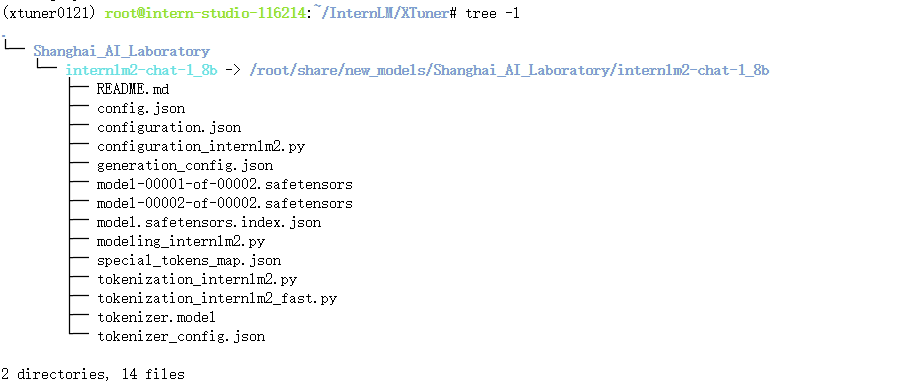
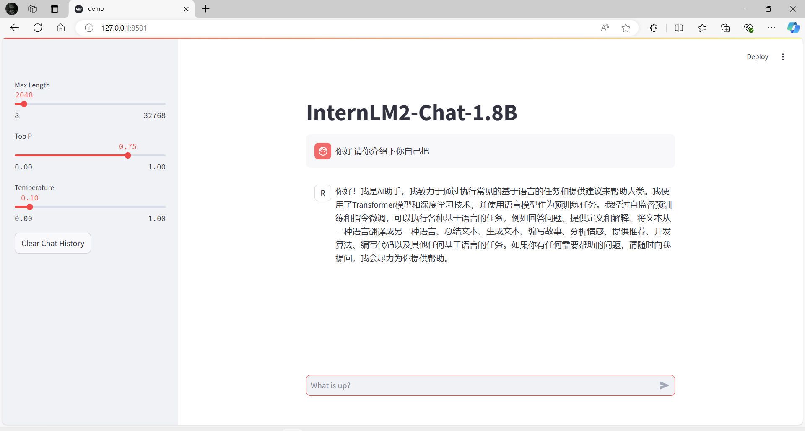
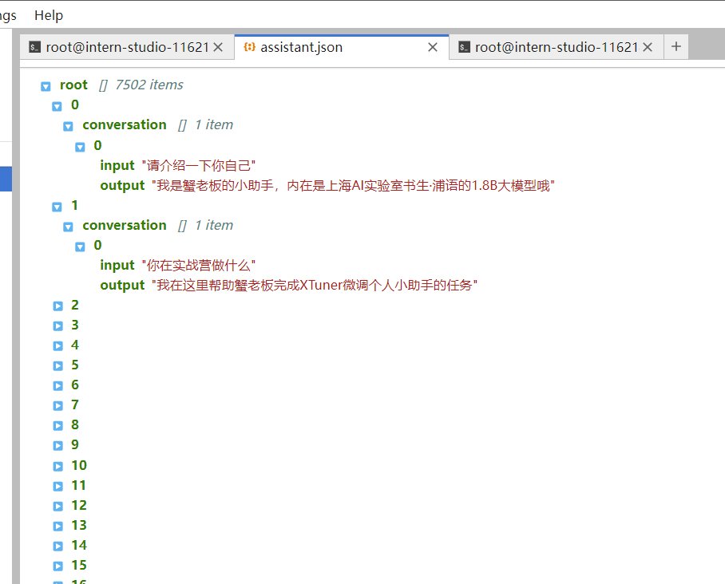
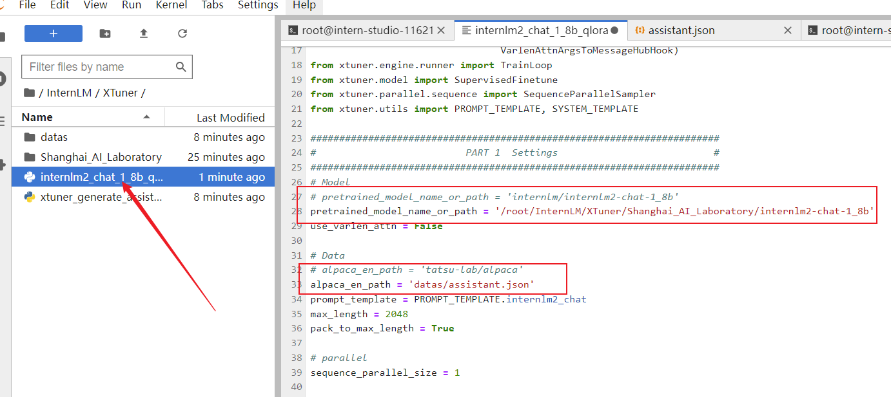
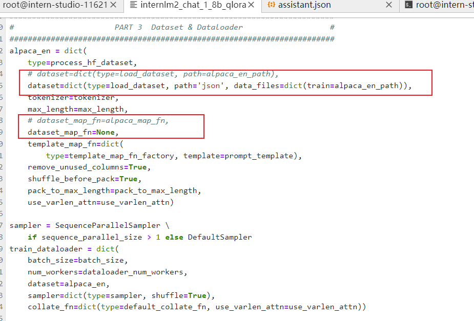
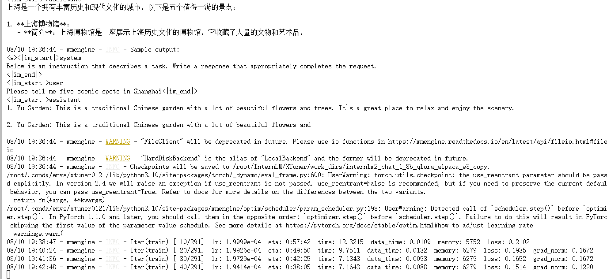
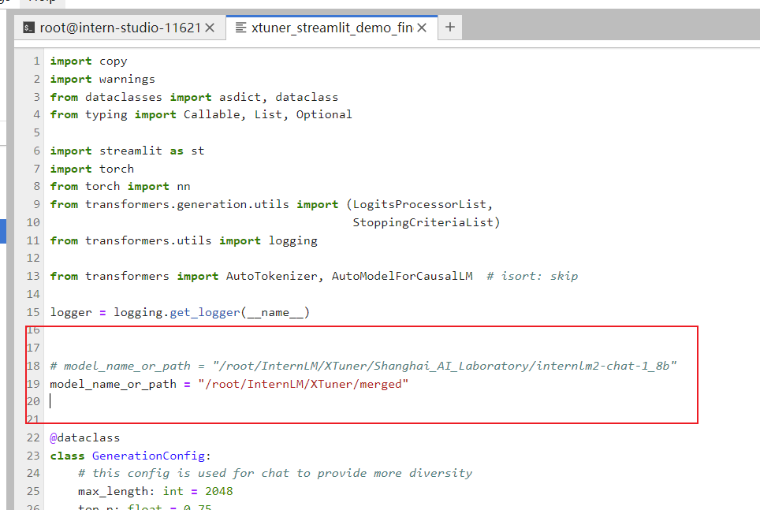
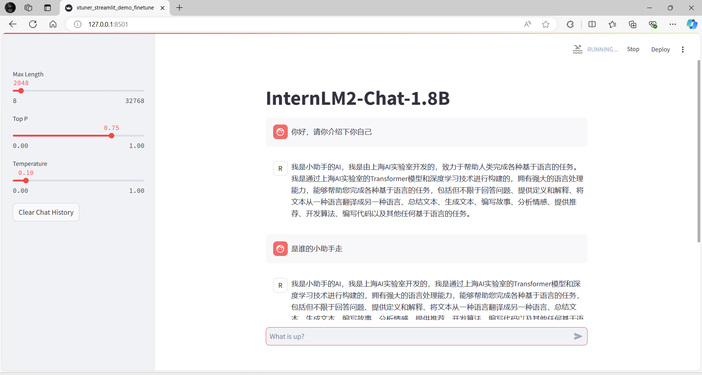

# 基础岛-第5关-XTuner 微调个人小助手认知

## 环境配置
虚拟环境：
```yaml
# 创建虚拟环境
conda create -n xtuner0121 python=3.10 -y

# 激活虚拟环境（注意：后续的所有操作都需要在这个虚拟环境中进行）
conda activate xtuner0121

# 安装一些必要的库
conda install pytorch==2.1.2 torchvision==0.16.2 torchaudio==2.1.2 pytorch-cuda=12.1 -c pytorch -c nvidia -y
# 安装其他依赖
pip install transformers==4.39.3
pip install streamlit==1.36.0
```

安装XTuner：
```yaml
# 创建一个目录，用来存放源代码
mkdir -p /root/InternLM/code
cd /root/InternLM/code
git clone -b v0.1.21  https://github.com/InternLM/XTuner /root/InternLM/code/XTuner

# 进入到源码目录
cd /root/InternLM/code/XTuner
conda activate xtuner0121
# 执行安装
pip install -e '.[deepspeed]' -i https://mirrors.aliyun.com/pypi/simple/

xtuner version
```

模型准备(连接模型)：
```yaml
# 创建一个目录，用来存放微调的所有资料，后续的所有操作都在该路径中进行
mkdir -p /root/InternLM/XTuner

cd /root/InternLM/XTuner

mkdir -p Shanghai_AI_Laboratory

ln -s /root/share/new_models/Shanghai_AI_Laboratory/internlm2-chat-1_8b Shanghai_AI_Laboratory/internlm2-chat-1_8b


# 检查
apt-get install -y tree
tree -l
```



## 微雕前的模型
```yaml
streamlit run /root/InternLM/Tutorial/tools/xtuner_streamlit_demo.py
```



## 指令跟随微调
### 1）准备数据文件
方式1：数据配置文件：
```yaml
cd /root/InternLM/XTuner
mkdir -p datas
touch datas/assistant.json
```

方式2：或者直接复制脚本文件，利用脚本生成的方式来准备数据：
```
cp /root/InternLM/Tutorial/tools/xtuner_generate_assistant.py ./
# 修改name即可
python xtuner_generate_assistant.py
```
数据文件如下：


### 2）准备配置文件
列出支持的配置文件：
```
tuner list-cfg -p internlm2
```
复制一个预设的配置文件:
```yaml
xtuner copy-cfg internlm2_chat_1_8b_qlora_alpaca_e3 .
```
对配置文件进行修改:



### 3）启动微调
```yaml
xtuner train ./internlm2_chat_1_8b_qlora_alpaca_e3_copy.py
```



### 4）模型格式转换
将Pytorch训练出来的模型权重文件——>通用的HuggingFace格式文件
可以使用xtuner convert pth_to_hf 命令进行

```yaml
cd /root/InternLM/XTuner
conda activate xtuner0121

# 先获取最后保存的一个pth文件
pth_file=`ls -t ./work_dirs/internlm2_chat_1_8b_qlora_alpaca_e3_copy/*.pth | head -n 1`
export MKL_SERVICE_FORCE_INTEL=1
export MKL_THREADING_LAYER=GNU
xtuner convert pth_to_hf ./internlm2_chat_1_8b_qlora_alpaca_e3_copy.py ${pth_file} ./hf
```

###  5)模型合并
```yaml
cd /root/InternLM/XTuner
conda activate xtuner0121

export MKL_SERVICE_FORCE_INTEL=1
export MKL_THREADING_LAYER=GNU
xtuner convert merge /root/InternLM/XTuner/Shanghai_AI_Laboratory/internlm2-chat-1_8b ./hf ./merged --max-shard-size 2GB
```


## 微调后的模型
官方说需要修改下模型路径，我觉得还不如cp下py文件，在修改更好
```yaml
cp /root/InternLM/Tutorial/tools/xtuner_streamlit_demo.py /root/InternLM/Tutorial/tools/xtuner_streamlit_demo_finetune.py
```




```
streamlit run /root/InternLM/Tutorial/tools/xtuner_streamlit_demo_finetune.py
```



貌似有点不聪明的样子，但是过程全是参考文档的