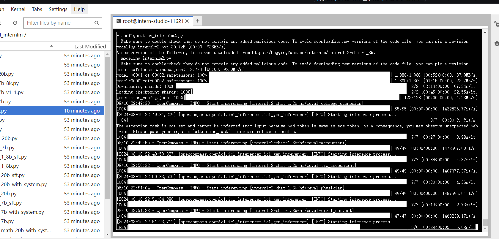
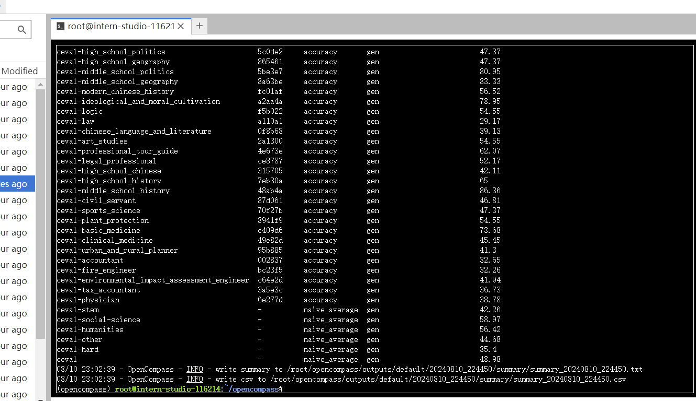

# 基础岛-第6关-OpenCompass 评测 InternLM-1.8B 实践

## 环境配置
```
conda create -n opencompass python=3.10
conda activate opencompass
conda install pytorch==2.1.2 torchvision==0.16.2 torchaudio==2.1.2 pytorch-cuda=12.1 -c pytorch -c nvidia -y

# 注意：一定要先 cd /root
cd /root
git clone -b 0.2.4 https://github.com/open-compass/opencompass
cd opencompass
pip install -e .


apt-get update
apt-get install cmake
pip install -r requirements.txt
pip install protobuf
```

## 数据准备
```yaml
# 解压评测数据集
cp /share/temp/datasets/OpenCompassData-core-20231110.zip /root/opencompass/
unzip OpenCompassData-core-20231110.zip
```

## 启动评测
```yaml
# 打开 opencompass文件夹下configs/models/hf_internlm/的hf_internlm2_chat_1_8b.py ,贴入以下代码

from opencompass.models import HuggingFaceCausalLM


models = [
    dict(
        type=HuggingFaceCausalLM,
        abbr='internlm2-1.8b-hf',
        path="/share/new_models/Shanghai_AI_Laboratory/internlm2-chat-1_8b",
        tokenizer_path='/share/new_models/Shanghai_AI_Laboratory/internlm2-chat-1_8b',
        model_kwargs=dict(
            trust_remote_code=True,
            device_map='auto',
        ),
        tokenizer_kwargs=dict(
            padding_side='left',
            truncation_side='left',
            use_fast=False,
            trust_remote_code=True,
        ),
        max_out_len=100,
        min_out_len=1,
        max_seq_len=2048,
        batch_size=8,
        run_cfg=dict(num_gpus=1, num_procs=1),
    )
]
```

```yaml
#环境变量配置
export MKL_SERVICE_FORCE_INTEL=1
#或
export MKL_THREADING_LAYER=GNU
python run.py --datasets ceval_gen --models hf_internlm2_chat_1_8b --debug

```


