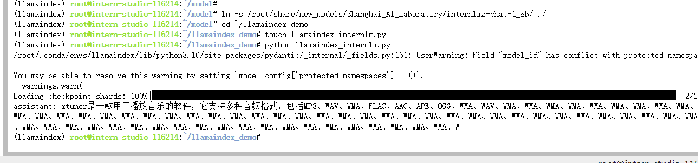
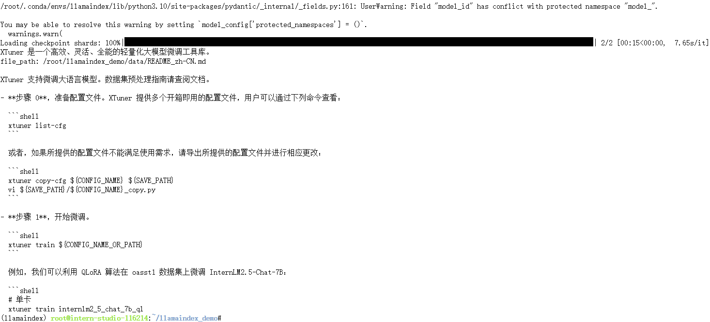

# 基础岛-第4关-InternLM+LlamaIndex RAG实践

## 0、效果预览：
使用RAG前：

使用RAG后：


## 1、环境配置
### 1.1虚拟环境配置：
```yaml
# 创建虚拟环境并激活环境
conda create -n llamaindex python=3.10
conda activate llamaindex
# 安装相关依赖
conda install pytorch==2.0.1 torchvision==0.15.2 torchaudio==2.0.2 pytorch-cuda=11.7 -c pytorch -c nvidia
pip install einops protobuf
```

### 1.2安装llamaindex:
```yaml
pip install llama-index==0.10.38 llama-index-llms-huggingface==0.2.0 "transformers[torch]==4.41.1" "huggingface_hub[inference]==0.23.1" huggingface_hub==0.23.1 sentence-transformers==2.7.0 sentencepiece==0.2.0
```

### 1.3下载SentenceTransformer模型：
```yaml
cd ~
mkdir llamaindex_demo
mkdir model
cd ~/llamaindex_demo
touch download_hf.py
vim download_hf.py # 代码内容如下：
```

```yaml
import os
# 设置环境变量
os.environ['HF_ENDPOINT'] = 'https://hf-mirror.com'
# 下载模型
os.system('huggingface-cli download --resume-download sentence-transformers/paraphrase-multilingual-MiniLM-L12-v2 --local-dir /root/model/sentence-transformer')
```

```yaml
python download_hf.py
```

### 1.4下载NLTK相关资源
```yaml
cd /root
git clone https://gitee.com/yzy0612/nltk_data.git  --branch gh-pages
cd nltk_data
mv packages/*  ./
cd tokenizers
unzip punkt.zip
cd ../taggers
unzip averaged_perceptron_tagger.zip
```


## 2、LlamaIndex HuggingFaceLLM

软连接InternLM2 1.8B：
```yaml
cd ~/model
ln -s /root/share/new_models/Shanghai_AI_Laboratory/internlm2-chat-1_8b/ ./
```

新建python脚本:
```yaml
cd ~/llamaindex_demo
touch llamaindex_internlm.py # 代码内容如下
```

```yaml
## llamaindex_internlm.py代码
from llama_index.llms.huggingface import HuggingFaceLLM
from llama_index.core.llms import ChatMessage
llm = HuggingFaceLLM(
    model_name="/root/model/internlm2-chat-1_8b",
    tokenizer_name="/root/model/internlm2-chat-1_8b",
    model_kwargs={"trust_remote_code":True},
    tokenizer_kwargs={"trust_remote_code":True}
)

rsp = llm.chat(messages=[ChatMessage(content="xtuner是什么？")])
print(rsp)
```


运行脚本以及效果图：
```yaml
python llamaindex_internlm.py
```


## 3、LlamaIndex RAG
安装llamaindex：
```yaml
pip install llama-index-embeddings-huggingface llama-index-embeddings-instructor

```

获取知识库：
```yaml
cd ~/llamaindex_demo
mkdir data
cd data
git clone https://github.com/InternLM/xtuner.git
mv xtuner/README_zh-CN.md ./

```

新建python脚本：
```yaml
touch llamaindex_RAG.py

```

```yaml

from llama_index.core import VectorStoreIndex, SimpleDirectoryReader, Settings

from llama_index.embeddings.huggingface import HuggingFaceEmbedding
from llama_index.llms.huggingface import HuggingFaceLLM

#初始化一个HuggingFaceEmbedding对象，用于将文本转换为向量表示
embed_model = HuggingFaceEmbedding(
#指定了一个预训练的sentence-transformer模型的路径
    model_name="/root/model/sentence-transformer"
)
#将创建的嵌入模型赋值给全局设置的embed_model属性，
#这样在后续的索引构建过程中就会使用这个模型。
Settings.embed_model = embed_model

llm = HuggingFaceLLM(
    model_name="/root/model/internlm2-chat-1_8b",
    tokenizer_name="/root/model/internlm2-chat-1_8b",
    model_kwargs={"trust_remote_code":True},
    tokenizer_kwargs={"trust_remote_code":True}
)
#设置全局的llm属性，这样在索引查询时会使用这个模型。
Settings.llm = llm

#从指定目录读取所有文档，并加载数据到内存中
documents = SimpleDirectoryReader("/root/llamaindex_demo/data").load_data()
#创建一个VectorStoreIndex，并使用之前加载的文档来构建索引。
# 此索引将文档转换为向量，并存储这些向量以便于快速检索。
index = VectorStoreIndex.from_documents(documents)
# 创建一个查询引擎，这个引擎可以接收查询并返回相关文档的响应。
query_engine = index.as_query_engine()
response = query_engine.query("xtuner是什么?")

print(response)
```


