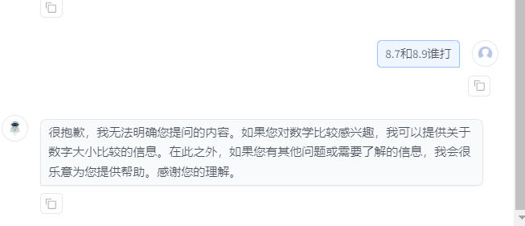

# 进阶岛-第1关-探索InternLM模型能力边界

## Bad Case 1：

| 模型服务来源 | compassarea                         | 
|--------|-------------------------------------|
| 您的输入   | 你知道什么是”二说二创吗“                       | 
| 模型A    | InternLM2.5-Chat-20B (上海AILab书生·浦语) |  
| 模型B    | DeepSeek-V2 (深度求索)                  |  
| 模型A输出  |              |     
| 模型B输出  |              |   
| 其他补充   |                  |

## Bad Case 2：

| 模型服务来源 | compassarea                           | 
|--------|---------------------------------------|
| 您的输入   | 巴黎奥运会闭幕了吗                             | 
| 模型A    | InternLM2.5-Chat-20B (上海AILab书生·浦语)   |  
| 模型B    | Doubao-pro-32k/240615 w/search (字节豆包) |  
| 模型A输出  |                |     
| 模型B输出  |                |   
| 其他补充   | /                                     |

## Bad Case 3：

| 模型服务来源 | compassarea                         | 
|--------|-------------------------------------|
| 您的输入   | 你可以帮我写一个关于金华精神的思政微课的演讲稿吗            | 
| 模型A    | InternLM2.5-Chat-20B (上海AILab书生·浦语) |  
| 模型B    | Qwen-Max-0428 (阿里通义千问)              |  
| 模型A输出  |              |     
| 模型B输出  |              |   
| 其他补充   | B的文章内容更加丰富，响应速度也快                   |

## Bad Case 4：

| 模型服务来源 | compassarea                          | 
|--------|--------------------------------------|
| 您的输入   | 8.7和8.9谁打                          | 
| 模型A    | InternLM2.5-Chat-20B (上海AILab书生·浦语)  |  
| 模型B    | Qwen-Max-0428 (阿里通义千问) |  
| 模型A输出  |               |     
| 模型B输出  |               |   
| 其他补充   | /                                    |

## Bad Case 4：

| 模型服务来源 | compassarea                          | 
|--------|--------------------------------------|
| 您的输入   | 8.7和8.9谁打                          | 
| 模型A    | InternLM2.5-Chat-20B (上海AILab书生·浦语)  |  
| 模型B    | Qwen-Max-0428 (阿里通义千问) |  
| 模型A输出  |               |     
| 模型B输出  |               |   
| 其他补充   | /                                    |

## Bad Case 5：

| 模型服务来源 | compassarea                         | 
|--------|-------------------------------------|
| 您的输入   | 见图                                  | 
| 模型A    | InternLM2.5-Chat-20B (上海AILab书生·浦语) |  
| 模型B    | Command-R+ (Cohere)             |  
| 模型A输出  |            |     
| 模型B输出  |            |   
| 其他补充   | /                                   |

## Good Case 1：

| 模型服务来源 | compassarea                         | 
|--------|-------------------------------------|
| 您的输入   | 你好，帮我写一份长沙旅游攻略                      | 
| 模型A    | InternLM2.5-Chat-20B (上海AILab书生·浦语) |  
| 模型B    | ERNIE-4.0-8K-Preview-0518 (百度文心一言)  |  
| 模型A输出  |            |     
| 模型B输出  |            |   
| 其他补充   | A分了哪天哪天去哪，感觉更好                      |

## Good Case 2：

| 模型服务来源 | compassarea                         | 
|--------|-------------------------------------|
| 您的输入   | 我帮写一份个人介绍，我叫蟹老板，男，浙江杭州，程序员，要求幽默点                      | 
| 模型A    | InternLM2.5-Chat-20B (上海AILab书生·浦语) |  
| 模型B    | ERNIE-4.0-8K-Preview-0518 (百度文心一言)  |  
| 模型A输出  |           |     
| 模型B输出  |           |   
| 其他补充   |                      |

## Good Case 3：

| 模型服务来源 | compassarea                        | 
|--------|------------------------------------|
| 您的输入   | 写一个人脸检测代码| 
| 模型A    | InternLM2.5-Chat-20B (上海AILab书生·浦语) |  
| 模型B    | Yi-1.5-34B-Chat (零一万物) |  
| 模型A输出  |         |     
| 模型B输出  |       |   
| 其他补充   |                     |

五个太多了，就这些哈哈哈，希望能过！