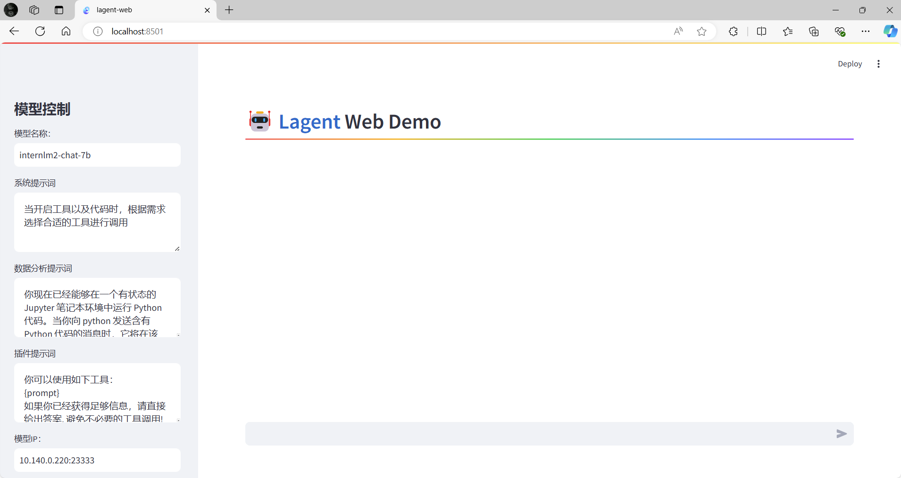
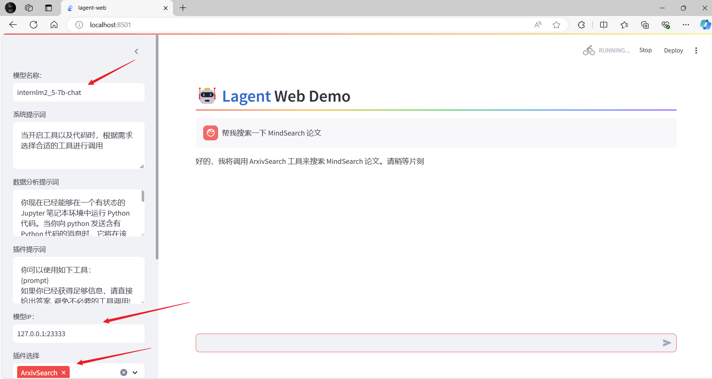
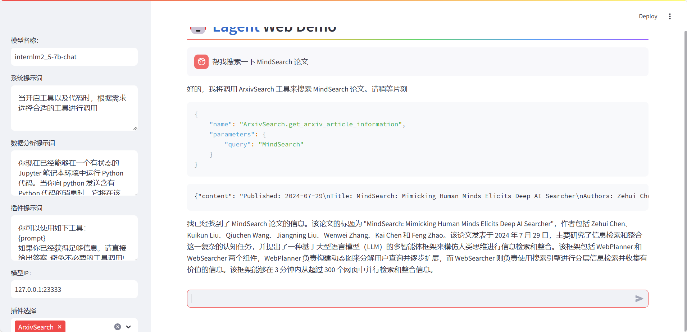
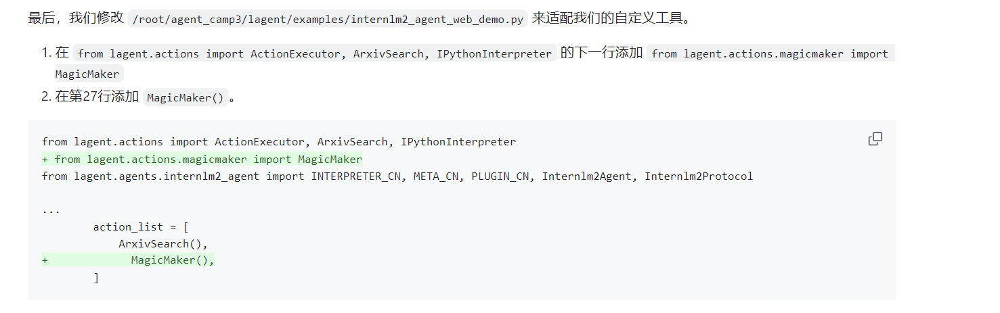
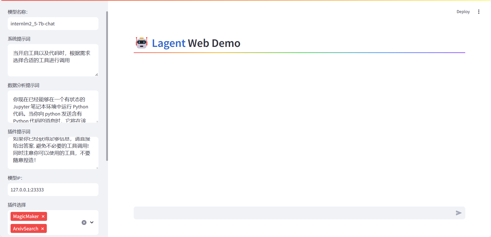
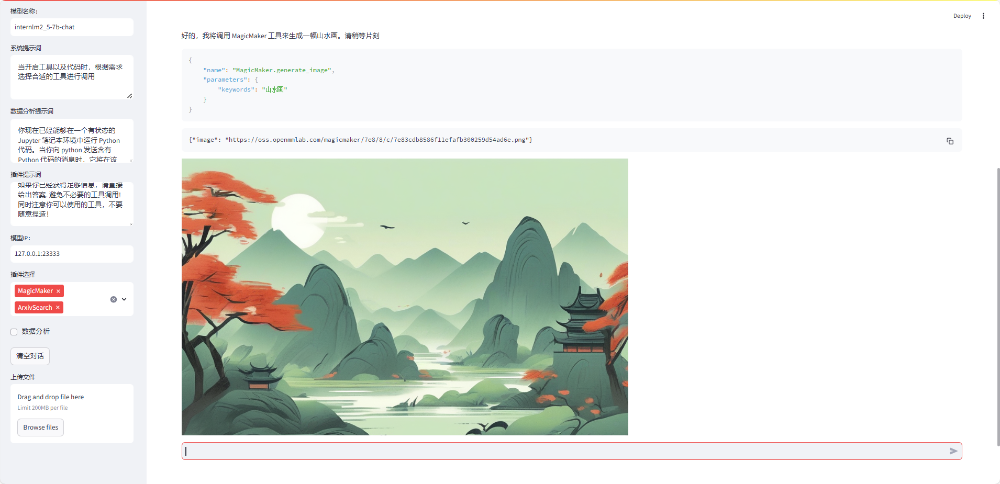

# 进阶岛-第2关-Lagent自定义你的Agent智能体

## 环境配置

虚拟环境：
```yaml
# 创建环境
conda create -n agent_camp3 python=3.10 -y
# 激活环境
conda activate agent_camp3
# 安装 torch
conda install pytorch==2.1.2 torchvision==0.16.2 torchaudio==2.1.2 pytorch-cuda=12.1 -c pytorch -c nvidia -y
# 安装其他依赖包
pip install termcolor==2.4.0
pip install lmdeploy==0.5.2
```

安装lagent：
```yaml
# 创建目录以存放代码
mkdir -p /root/agent_camp3
cd /root/agent_camp3
git clone https://github.com/InternLM/lagent.git
cd lagent && git checkout 81e7ace && pip install -e . && cd ..


```

## Lagent Web Demo 使用
启动一个 API Server：
```
lmdeploy serve api_server /share/new_models/Shanghai_AI_Laboratory/internlm2_5-7b-chat --model-name internlm2_5-7b-chat
```

新开一个终端，启动 Lagent 的 Web Demo:
```yaml
cd /root/agent_camp3/lagent
conda activate agent_camp3
streamlit run examples/internlm2_agent_web_demo.py
```
端口映射：
ssh -CNg -L 8501:127.0.0.1:8501 -L 23333:127.0.0.1:23333 root@ssh.intern-ai.org.cn -p 

本地打开：127.0.0.1:8501


修改参数：


效果：


## 基于 Lagent 自定义智能体
创建文件：
```yaml
cd /root/agent_camp3/lagent
touch lagent/actions/magicmaker.py
```
```yaml
import json
import requests

from lagent.actions.base_action import BaseAction, tool_api
from lagent.actions.parser import BaseParser, JsonParser
from lagent.schema import ActionReturn, ActionStatusCode


class MagicMaker(BaseAction):
    styles_option = [
        'dongman',  # 动漫
        'guofeng',  # 国风
        'xieshi',   # 写实
        'youhua',   # 油画
        'manghe',   # 盲盒
    ]
    aspect_ratio_options = [
        '16:9', '4:3', '3:2', '1:1',
        '2:3', '3:4', '9:16'
    ]

    def __init__(self,
                 style='guofeng',
                 aspect_ratio='4:3'):
        super().__init__()
        if style in self.styles_option:
            self.style = style
        else:
            raise ValueError(f'The style must be one of {self.styles_option}')
        
        if aspect_ratio in self.aspect_ratio_options:
            self.aspect_ratio = aspect_ratio
        else:
            raise ValueError(f'The aspect ratio must be one of {aspect_ratio}')
    
    @tool_api
    def generate_image(self, keywords: str) -> dict:
        """Run magicmaker and get the generated image according to the keywords.

        Args:
            keywords (:class:`str`): the keywords to generate image

        Returns:
            :class:`dict`: the generated image
                * image (str): path to the generated image
        """
        try:
            response = requests.post(
                url='https://magicmaker.openxlab.org.cn/gw/edit-anything/api/v1/bff/sd/generate',
                data=json.dumps({
                    "official": True,
                    "prompt": keywords,
                    "style": self.style,
                    "poseT": False,
                    "aspectRatio": self.aspect_ratio
                }),
                headers={'content-type': 'application/json'}
            )
        except Exception as exc:
            return ActionReturn(
                errmsg=f'MagicMaker exception: {exc}',
                state=ActionStatusCode.HTTP_ERROR)
        image_url = response.json()['data']['imgUrl']
        return {'image': image_url}
```

修改 /root/agent_camp3/lagent/examples/internlm2_agent_web_demo.py:


本地刷新并配置参数，重新对话，效果如下：

