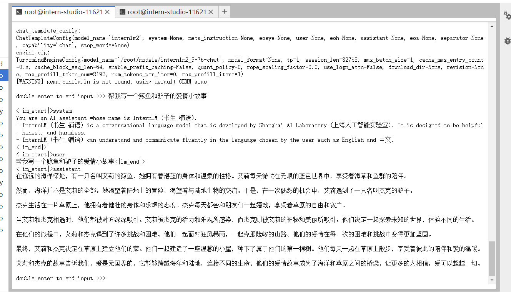
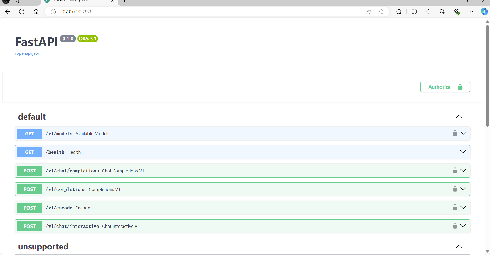
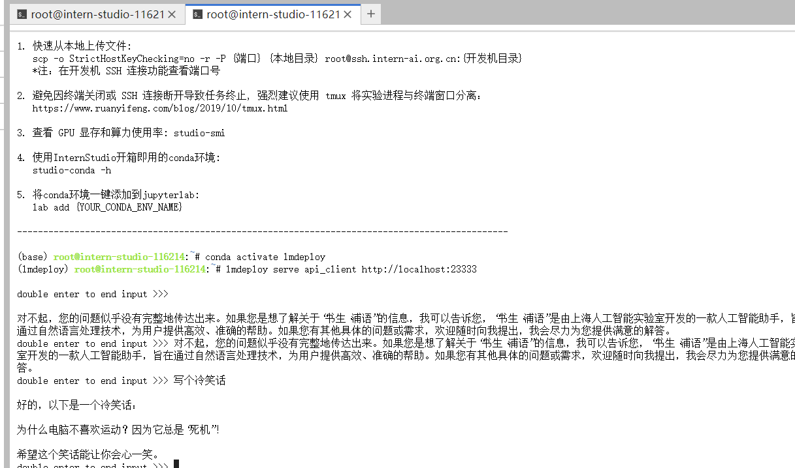
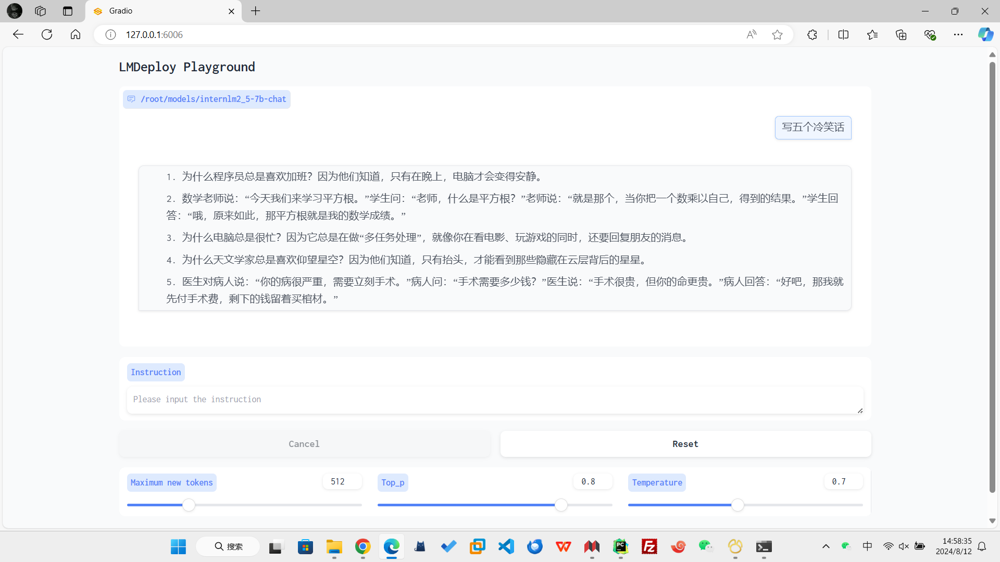
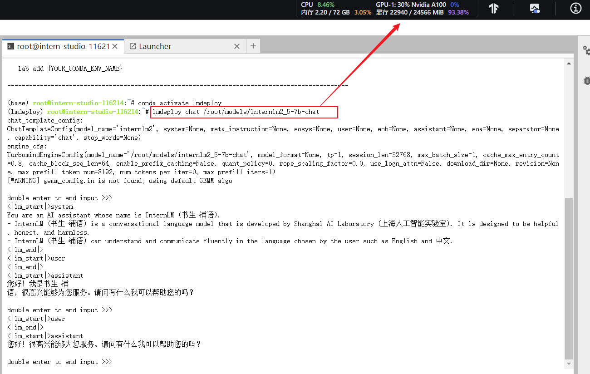
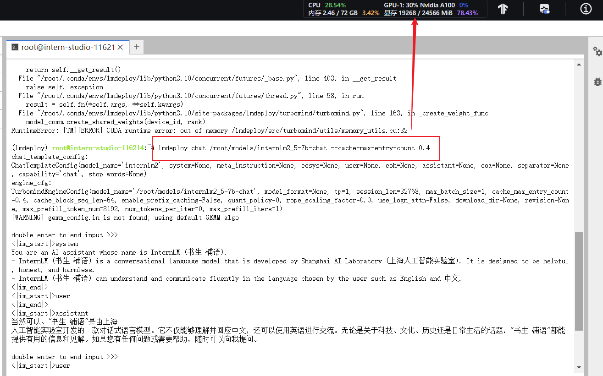
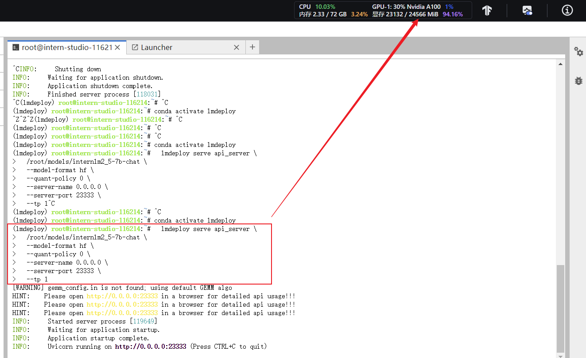
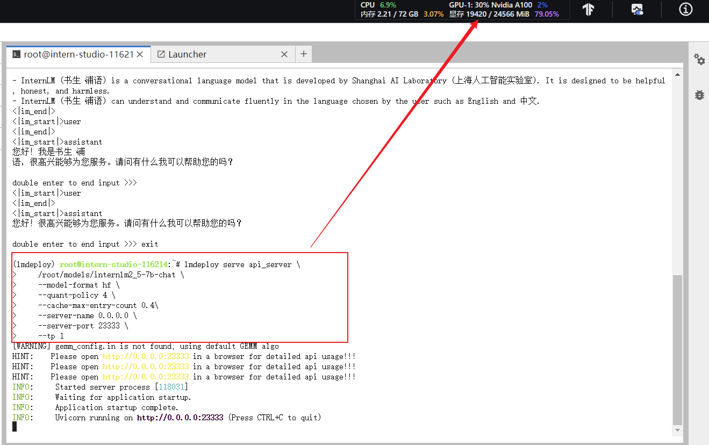
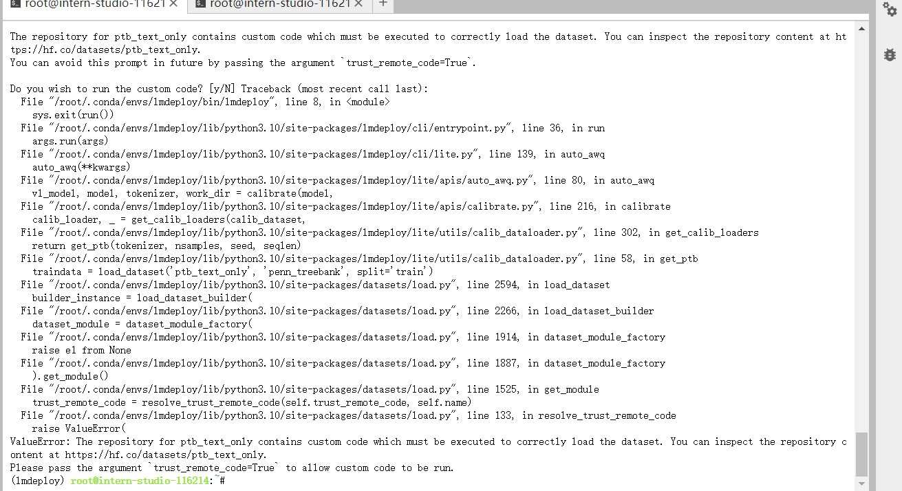

# 进阶岛-第3关-LMDeploy 量化部署进阶实践

## 1、配置LMDeploy环境

虚拟环境：

```yaml
conda create -n lmdeploy  python=3.10 -y
conda activate lmdeploy
pip install torch torchvision torchaudio pytorch-cuda
pip install timm==1.0.8 openai==1.40.3 lmdeploy[all]==0.5.3
```

InternStudio环境获取模型：

```yaml
mkdir /root/models
ln -s /root/share/new_models//Shanghai_AI_Laboratory/internlm2_5-7b-chat /root/models
ln -s /root/share/new_models/OpenGVLab/InternVL2-26B /root/models
```

LMDeploy验证启动模型文件:

```yaml
conda activate lmdeploy
lmdeploy chat /root/models/internlm2_5-7b-chat
```



## 2、LMDeploy与InternLM2.5

### 2.1 LMDeploy API部署InternLM2.5

#### 2.1.1 启动API服务器

启动API服务器，部署InternLM2.5模型：

```yaml
conda activate lmdeploy
  lmdeploy serve api_server \
  /root/models/internlm2_5-7b-chat \
  --model-format hf \
  --quant-policy 0 \
  --server-name 0.0.0.0 \
  --server-port 23333 \
  --tp 1

  '''
命令解释：
lmdeploy serve api_server：这个命令用于启动API服务器。
/root/models/internlm2_5-7b-chat：这是模型的路径。
--model-format hf：这个参数指定了模型的格式。hf代表“Hugging Face”格式。
--quant-policy 0：这个参数指定了量化策略。
--server-name 0.0.0.0：这个参数指定了服务器的名称。在这里，0.0.0.0是一个特殊的IP地址，它表示所有网络接口。
--server-port 23333：这个参数指定了服务器的端口号。在这里，23333是服务器将监听的端口号。
--tp 1：这个参数表示并行数量（GPU数量）。
'''
```

端口映射： ssh -CNg -L 23333:127.0.0.1:23333 root@ssh.intern-ai.org.cn -p 你的ssh端口号



#### 2.1.2 以命令行形式连接API服务器

启动命令行客户端：

```yaml
conda activate lmdeploy
lmdeploy serve api_client http://localhost:23333
```



#### 2.1.3 以Gradio网页形式连接API服务器

```yaml
conda activate lmdeploy
lmdeploy serve gradio http://localhost:23333 \
--server-name 0.0.0.0 \
--server-port 6006
```

端口映射：ssh -CNg -L 6006:127.0.0.1:6006 root@ssh.intern-ai.org.cn -p <你的ssh端口号>



### 2.2 LMDeploy Lite

#### 2.2.1 设置最大kv cache缓存大小

```yaml
lmdeploy chat /root/models/internlm2_5-7b-chat
```


使用kv cache缓存技术：

```yaml
lmdeploy chat /root/models/internlm2_5-7b-chat --cache-max-entry-count 0.4
```



#### 2.2.2 设置在线 kv cache int4/int8 量化
自 v0.4.0 起，LMDeploy 支持在线 kv cache int4/int8 量化，量化方式为 per-head per-token 的非对称量化。此外，通过 LMDeploy 应用 kv 量化非常简单，只需要设定 quant_policy 和cache-max-entry-count参数。目前，LMDeploy 规定 qant_policy=4 表示 kv int4 量化，quant_policy=8 表示 kv int8 量化。

未设置在线 kv cache int4/int8 量化:

设置在线 kv cache int4/int8 量化:
```yaml
lmdeploy serve api_server \
    /root/models/internlm2_5-7b-chat \
    --model-format hf \
    --quant-policy 4 \
    --cache-max-entry-count 0.4\
    --server-name 0.0.0.0 \
    --server-port 23333 \
    --tp 1
```



#### 2.2.3 W4A16 模型量化和部署

#### 2.2.4 W4A16 量化+ KV cache+KV cache 量化

输入以下指令，让我们同时启用量化后的模型、设定kv cache占用和kv cache int4量化。

```yaml
lmdeploy serve api_server \
    /root/models/internlm2_5-7b-chat-w4a16-4bit/ \
    --model-format awq \
    --quant-policy 4 \
    --cache-max-entry-count 0.4\
    --server-name 0.0.0.0 \
    --server-port 23333 \
    --tp 1
```

## 3、LMDeploy与InternVL2
###3.1 LMDeploy Lite

#### 3.1.1 W4A16 模型量化和部署
```yaml
conda activate lmdeploy
lmdeploy lite auto_awq \
   /root/models/InternVL2-26B \
  --calib-dataset 'ptb' \
  --calib-samples 128 \
  --calib-seqlen 2048 \
  --w-bits 4 \
  --w-group-size 128 \
  --batch-size 1 \
  --search-scale False \
  --work-dir /root/models/InternVL2-26B-w4a16-4bit
```

#### 3.1.2 W4A16 量化+ KV cache+KV cache 量化
启用量化后的模型。
```yaml
lmdeploy serve api_server \
    /root/models/InternVL2-26B-w4a16-4bit \
    --model-format awq \
    --quant-policy 4 \
    --cache-max-entry-count 0.1\
    --server-name 0.0.0.0 \
    --server-port 23333 \
    --tp 1
```

### 3.2 LMDeploy API部署InternVL2
```yaml
lmdeploy serve api_server \
    /root/models/InternVL2-26B-w4a16-4bit/ \
    --model-format awq \
    --quant-policy 4 \
    --cache-max-entry-count 0.6 \
    --server-name 0.0.0.0 \
    --server-port 23333 \
    --tp 1

```

在这里出现了报错：



## 4、LMDeploy之FastAPI与Function call
### 4.1 API开发
启动API服务器:
```yaml
conda activate lmdeploy
lmdeploy serve api_server \
    /root/models/internlm2_5-7b-chat-w4a16-4bit \
    --model-format awq \
    --cache-max-entry-count 0.4 \
    --quant-policy 4 \
    --server-name 0.0.0.0 \
    --server-port 23333 \
    --tp 1
```
新建窗口，`touch /root/internlm2_5.py`

复制代码，并允许脚本`python /root/internlm2_5.py`

```yaml
# 导入openai模块中的OpenAI类，这个类用于与OpenAI API进行交互
from openai import OpenAI


# 创建一个OpenAI的客户端实例，需要传入API密钥和API的基础URL
client = OpenAI(
    api_key='YOUR_API_KEY',  
    # 替换为你的OpenAI API密钥，由于我们使用的本地API，无需密钥，任意填写即可
    base_url="http://0.0.0.0:23333/v1"  
    # 指定API的基础URL，这里使用了本地地址和端口
)

# 调用client.models.list()方法获取所有可用的模型，并选择第一个模型的ID
# models.list()返回一个模型列表，每个模型都有一个id属性
model_name = client.models.list().data[0].id

# 使用client.chat.completions.create()方法创建一个聊天补全请求
# 这个方法需要传入多个参数来指定请求的细节
response = client.chat.completions.create(
  model=model_name,  
  # 指定要使用的模型ID
  messages=[  
  # 定义消息列表，列表中的每个字典代表一个消息
    {"role": "system", "content": "你是一个友好的小助手，负责解决问题."},  
    # 系统消息，定义助手的行为
    {"role": "user", "content": "帮我讲述一个关于狐狸和西瓜的小故事"},  
    # 用户消息，询问时间管理的建议
  ],
    temperature=0.8,  
    # 控制生成文本的随机性，值越高生成的文本越随机
    top_p=0.8  
    # 控制生成文本的多样性，值越高生成的文本越多样
)

# 打印出API的响应结果
print(response.choices[0].message.content)
```

