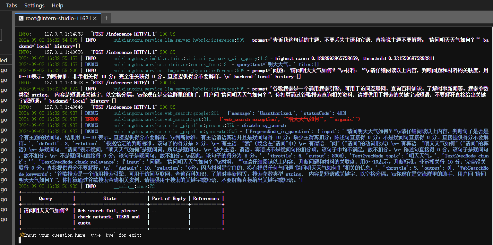
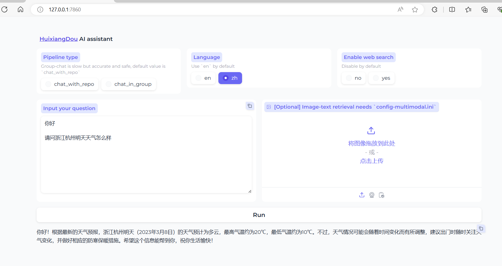

# 进阶岛-第5关-茴香豆：企业级知识库问答工具


## 环境配置

```yaml
studio-conda -o internlm-base -t huixiangdou

conda activate huixiangdou
```


## 安装茴香豆
下载茴香豆
```yaml
cd /root
# 克隆代码仓库
git clone https://github.com/internlm/huixiangdou && cd huixiangdou
git checkout 79fa810
```

安装所需的库
```yaml
conda activate huixiangdou
# parsing `word` format requirements
apt update
apt install python-dev libxml2-dev libxslt1-dev antiword unrtf poppler-utils pstotext tesseract-ocr flac ffmpeg lame libmad0 libsox-fmt-mp3 sox libjpeg-dev swig libpulse-dev
# python requirements
pip install BCEmbedding cmake lit sentencepiece protobuf accelerate
pip install -r requirements.txt
# python3.8 安装 faiss-gpu 而不是 faiss
```

下载模型文件
```yaml
# 创建模型文件夹
cd /root && mkdir models

# 复制BCE模型
ln -s /root/share/new_models/maidalun1020/bce-embedding-base_v1 /root/models/bce-embedding-base_v1
ln -s /root/share/new_models/maidalun1020/bce-reranker-base_v1 /root/models/bce-reranker-base_v1

# 复制大模型参数（下面的模型，根据作业进度和任务进行**选择一个**就行）
ln -s /root/share/new_models/Shanghai_AI_Laboratory/internlm2-chat-7b /root/models/internlm2-chat-7b
```

更改配置文件
```yaml
sed -i '9s#.*#embedding_model_path = "/root/models/bce-embedding-base_v1"#' /root/huixiangdou/config.ini
sed -i '15s#.*#reranker_model_path = "/root/models/bce-reranker-base_v1"#' /root/huixiangdou/config.ini
sed -i '43s#.*#local_llm_path = "/root/models/internlm2-chat-7b"#' /root/huixiangdou/config.ini
```

## 知识库创建

```
conda activate huixiangdou

cd /root/huixiangdou && mkdir repodir

git clone https://github.com/internlm/huixiangdou --depth=1 repodir/huixiangdou
git clone https://github.com/open-mmlab/mmpose    --depth=1 repodir/mmpose

# Save the features of repodir to workdir, and update the positive and negative example thresholds into `config.ini`
mkdir workdir
python3 -m huixiangdou.service.feature_store
```

## 测试知识助手
命令行测试：
```yaml
conda activate huixiangdou
cd /root/huixiangdou
python3 -m huixiangdou.main --standalone
```



界面测试
```yaml
conda activate huixiangdou
cd /root/huixiangdou
python3 -m huixiangdou.gradio
```

