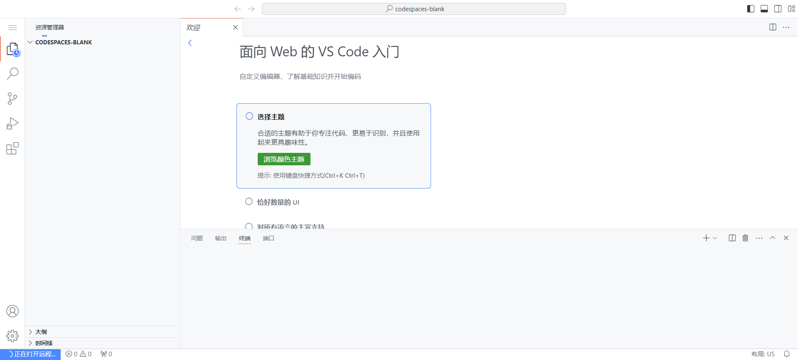
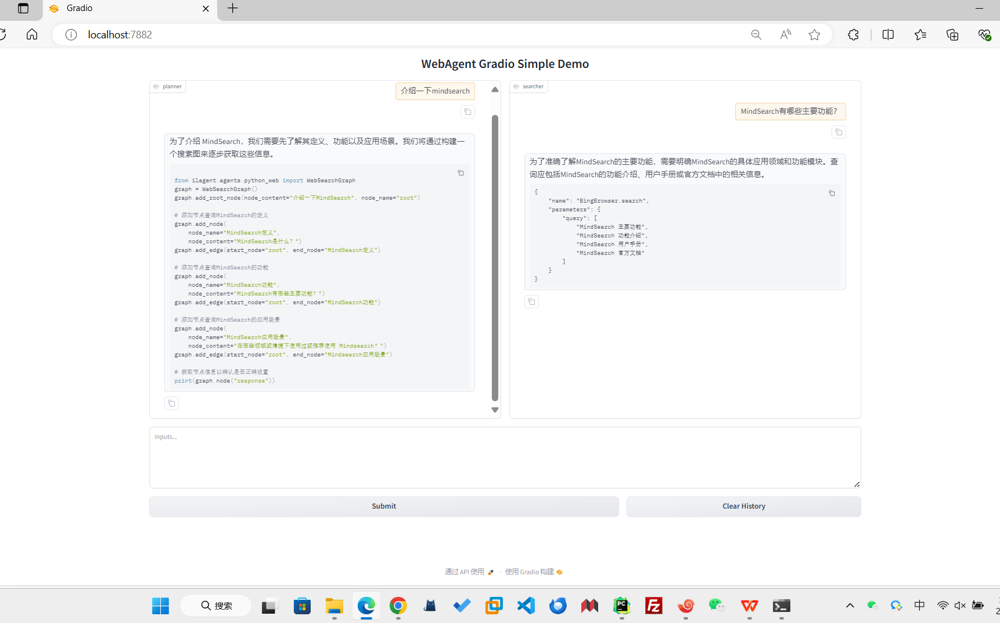
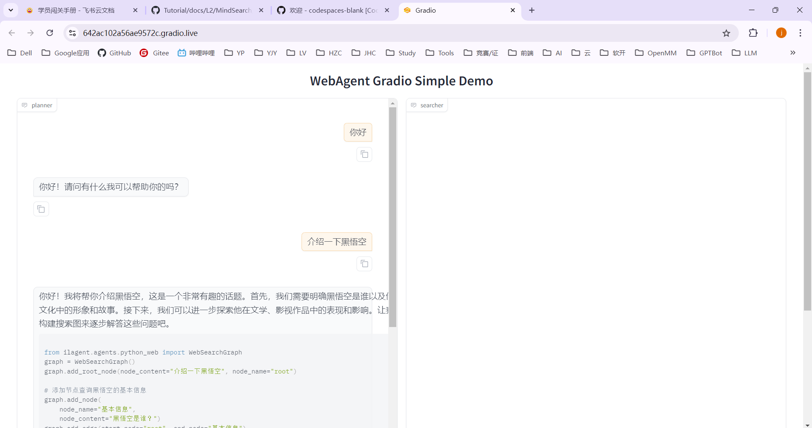
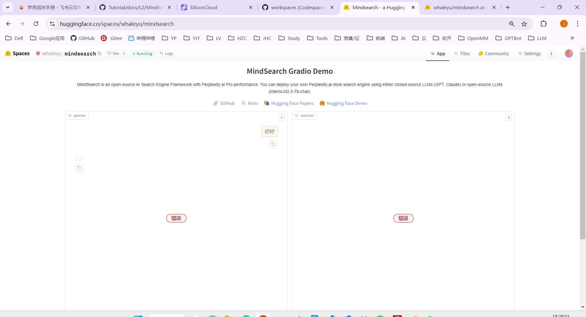
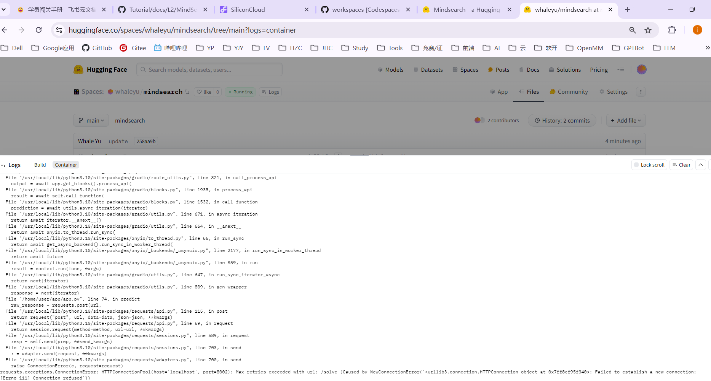

# 第6关-MindSearch快速部署

## 1. 创建开发机 & 环境配置
打开https://github.com/codespaces-blank



新建一个目录用于存放 MindSearch 的相关代码，并把 MindSearch 仓库 clone:
```yaml
mkdir -p /workspaces/mindsearch
cd /workspaces/mindsearch
git clone https://github.com/InternLM/MindSearch.git
cd MindSearch && git checkout b832275 && cd ..
```


conda 环境:
```
# 创建环境
conda create -n mindsearch python=3.10 -y
# 激活环境
conda activate mindsearch
# 安装依赖
pip install -r /workspaces/mindsearch/MindSearch/requirements.txt
pip install class_registry
```

## 2. 获取硅基流动 API Key

因为要使用硅基流动的 API Key，所以接下来便是注册并获取 API Key 了。

首先，我们打开 https://account.siliconflow.cn/login 来注册硅基流动的账号（如果注册过，则直接登录即可）。

在完成注册后，打开 https://cloud.siliconflow.cn/account/ak 来准备 API Key。首先创建新 API 密钥，然后点击密钥进行复制，以备后续使用。


## 3. 启动 MindSearch
启动后端:
```yaml
export SILICON_API_KEY=sk-azcbyvldxuomkufzbqeuowwrjhkvgnmckijwolctbosjnapa
conda activate mindsearch
cd /workspaces/mindsearch/MindSearch
python -m mindsearch.app --lang cn --model_format internlm_silicon --search_engine DuckDuckGoSearch
```

启动前端：
```yaml
conda activate mindsearch
cd /root/mindsearch/MindSearch
python frontend/mindsearch_gradio.py
```




## 部署到 HuggingFace Space
流程见官方文档：

https://huggingface.co/spaces/whaleyu/mindsearch



hf平台报错，暂未解决


