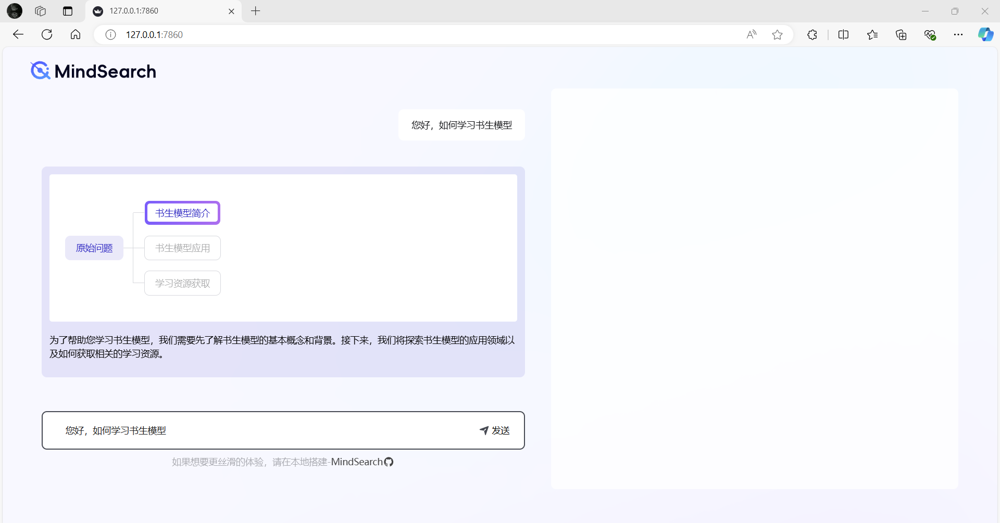

# 彩蛋岛-第一关-MindSearch快速部署


## 使用免费的搜索接口

启动后端：
```yaml
conda activate /share/pre_envs/mindsearch
cd /share/demo/MindSearchDuck

python -m mindsearch.app --lang cn --model_format internstudio_server
# 将端口映射到本地 8002 端口
```

启动前端：
```yaml
conda activate /share/pre_envs/mindsearch
cd /share/demo/MindSearchDuck

python run.py
# 将端口映射到本地 7860 端口
```
